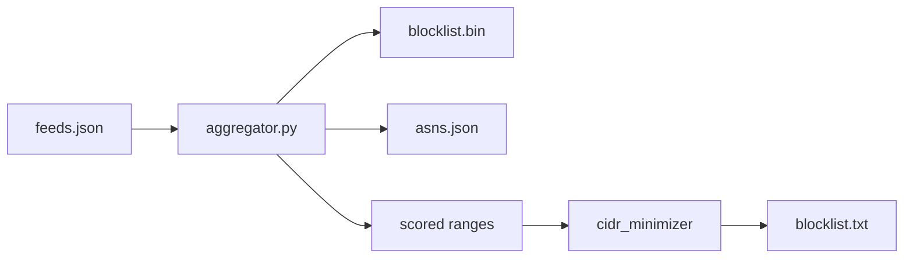
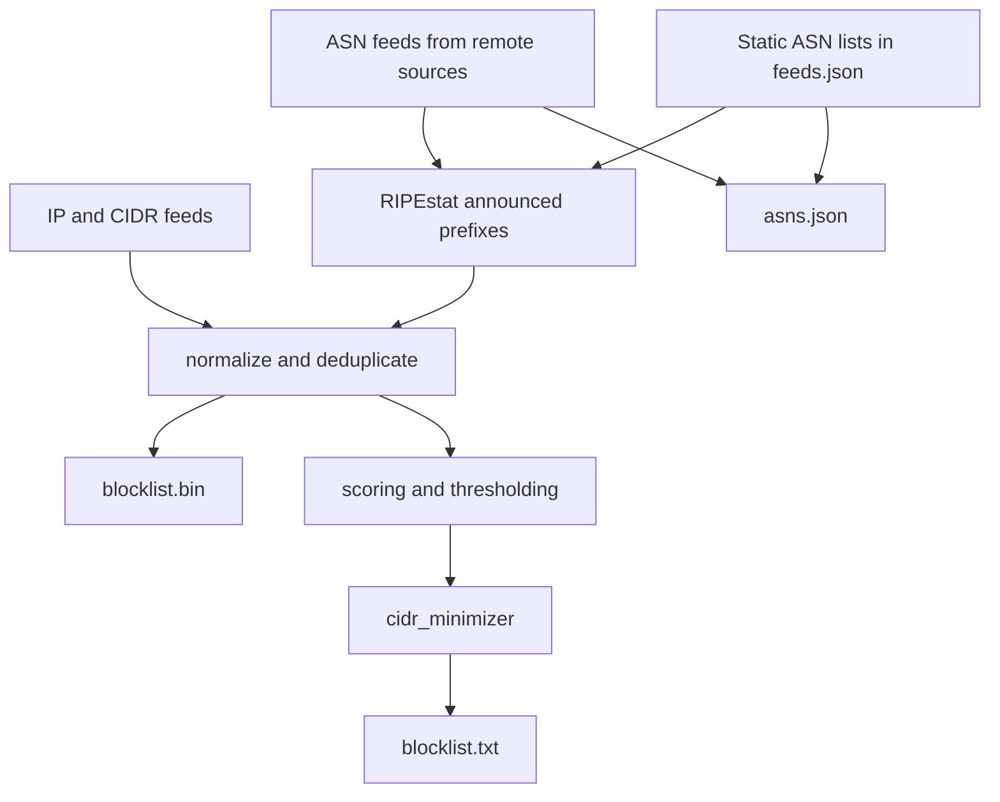

<div align="center">

# IPBlocklist

<p align="center">


</p>

</div>

IPBlocklist aggregates IP and ASN threat intelligence into three release
artifacts:

- `blocklist.bin`: compact binary data for application lookups
- `blocklist.txt`: scored, CIDR-minimized text blocklist for firewalls
- `asns.json`: normalized ASN lists keyed by feed name

The current dataset is built from 150 feeds and includes IPv4, IPv6, CIDR
ranges, announced prefixes derived from ASN feeds, and proxy-type ranges from
IP2X.

## Downloads

```bash
wget https://github.com/tn3w/IPBlocklist/releases/latest/download/blocklist.bin
wget https://github.com/tn3w/IPBlocklist/releases/latest/download/blocklist.txt
wget https://github.com/tn3w/IPBlocklist/releases/latest/download/asns.json
```

## Visualizations





## Pipeline

`aggregator.py` downloads feed data, extracts IPs, CIDRs, and ASNs, resolves
ASN feeds to announced prefixes through RIPEstat, merges everything into a
common range format, writes `blocklist.bin`, writes `asns.json`, then passes
scored ranges to `cidr_minimizer` to produce `blocklist.txt`.

Feeds marked with `is_asn` support two input modes:

- Remote ASN feed: use `url` and `regex`
- Static ASN feed: use `asns` and leave `url` and `regex` empty

Non-malicious ASN category feeds can use `base_score: 0.0` so they remain
available in `blocklist.bin` and `asns.json` without affecting `blocklist.txt`.

## Artifacts

### `blocklist.bin`

Binary format for fast lookups.

```text
[4 bytes: timestamp]
[2 bytes: feed count]
for each feed:
  [1 byte: feed name length]
  [N bytes: feed name]
  [4 bytes: range count]
  for each range:
    [varint: start delta]
    [varint: range size]
```

### `blocklist.txt`

Text blocklist generated from scored ranges after thresholding, CIDR promotion,
and non-routable range removal.

Supported output forms:

- Single IPv4: `1.2.3.4`
- IPv4 CIDR: `1.2.3.0/24`
- IPv4 range: `1.2.3.1-1.2.3.254`
- Single IPv6: `2001:db8::1`
- IPv6 CIDR: `2001:db8::/32`
- IPv6 range: `2001:db8::1-2001:db8::ff`

### `asns.json`

JSON object keyed by feed name.

```json
{
  "datacenter_asns": ["16509", "15169"],
  "bgptools_c2_asns": ["14618"],
  "bgptools_tor_asns": ["60729", "53667"],
  "tor_static_asns": ["60729", "53667"]
}
```

## Feed Model

Common fields:

- `name`
- `description`
- `base_score`
- `confidence`
- `flags`
- `categories`

IP and CIDR feed fields:

- `url`
- `regex`

ASN feed fields:

- `is_asn`
- `url` and `regex`, or `asns`

Optional fields:

- `provider_name`
- `asns`

## ASN Feeds

`asns.json` currently contains these feed names:

```text
datacenter_asns
bgptools_personal_asns
bgptools_dsl_asns
bgptools_cdn_asns
bgptools_top10k_asns
bgptools_vpn_asns
bgptools_critical_infra_asns
bgptools_tor_asns
tor_static_asns
bgptools_government_asns
bgptools_academic_asns
bgptools_ipv6_only_asns
bgptools_event_asns
bgptools_server_hosting_asns
bgptools_c2_asns
bgptools_ddos_mitigation_asns
bgptools_mobile_asns
bgptools_business_broadband_asns
bgptools_satellite_asns
bgptools_direct_feed_asns
bgptools_corporate_asns
bgptools_anycast_asns
bgptools_rpki_rov_asns
```

`bgptools_tor_asns` is downloaded from BGP.tools.

`tor_static_asns` is a static ASN feed stored directly in `feeds.json`.

## Usage

Build the artifacts locally:

```bash
python aggregator.py
```

Query `blocklist.bin` for one or more IPs:

```bash
python lookup.py 8.8.8.8 1.1.1.1
```

Load the text blocklist into `ipset`:

```bash
ipset create blocklist hash:net
while IFS= read -r line; do
  [[ "$line" =~ ^# ]] && continue
  ipset add blocklist "$line" 2>/dev/null
done < blocklist.txt
```

Read `asns.json` in Python:

```python
import json


with open("asns.json") as file:
    asn_lists = json.load(file)

tor_asns = set(asn_lists["bgptools_tor_asns"])
print("60729" in tor_asns)
```

Check whether an IP is covered by `blocklist.txt` in Python:

```python
import ipaddress


def line_matches_ip(line, address):
  if not line or line.startswith("#"):
    return False

  if "-" in line:
    start_text, end_text = line.split("-", 1)
    start = ipaddress.ip_address(start_text)
    end = ipaddress.ip_address(end_text)
    return int(start) <= int(address) <= int(end)

  if "/" in line:
    return address in ipaddress.ip_network(line, strict=False)

  return address == ipaddress.ip_address(line)


def ip_in_blocklist_txt(ip_value, path="blocklist.txt"):
  address = ipaddress.ip_address(ip_value)

  with open(path) as file:
    for raw_line in file:
      if line_matches_ip(raw_line.strip(), address):
        return True

  return False


print(ip_in_blocklist_txt("8.8.8.8"))
```

## Performance

- Total feeds: 150
- Proxy type ranges: 4.1M
- Total entries: about 9.1M
- Typical lookup latency: under 1 ms
- Binary size: about 12 MB

## Contributers
- [tn3w](https://github.com/tn3w)
- [silviucpp](https://github.com/silviucpp)

## License

[LICENSE](LICENSE)
