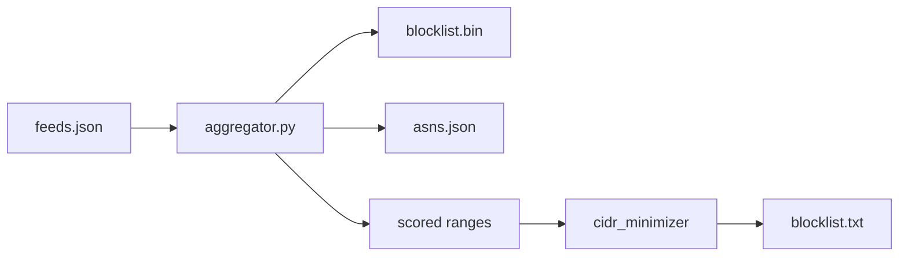
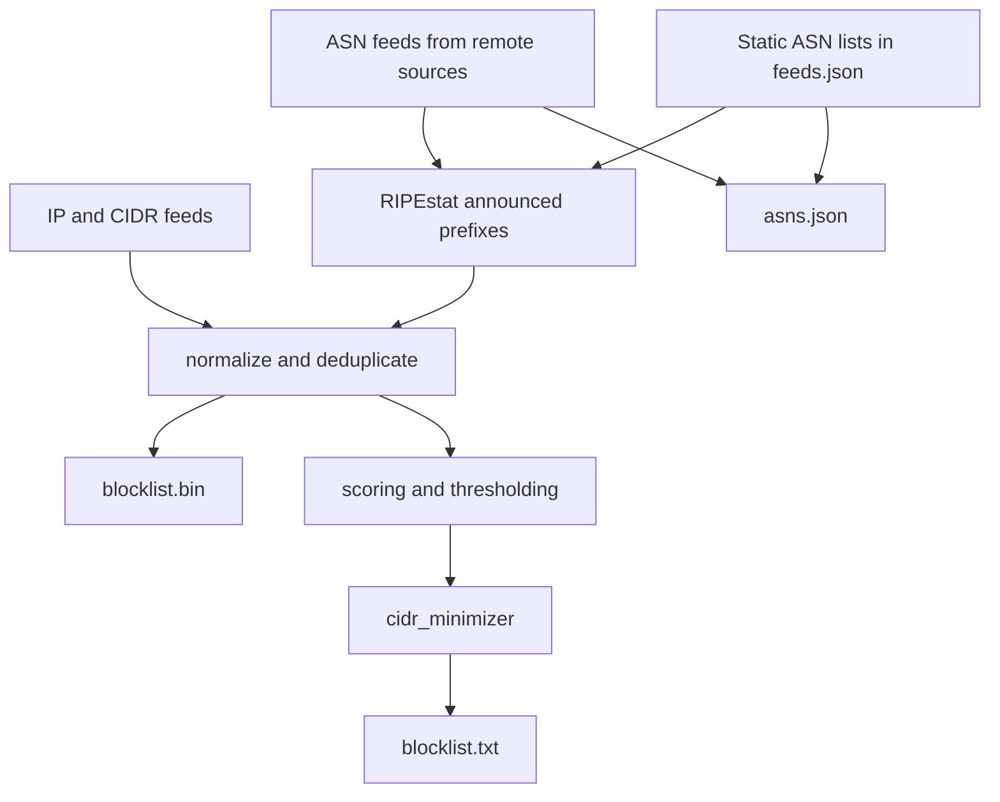

<div align="center">

# IPBlocklist

<p align="center">


</p>

</div>

IPBlocklist aggregates IP and ASN threat intelligence into three release
artifacts:

- `blocklist.bin`: compact binary data for application lookups
- `blocklist.txt`: scored, CIDR-minimized text blocklist for firewalls
- `asns.json`: normalized ASN lists keyed by feed name

The current dataset is built from 176 feeds and includes IPv4, IPv6, CIDR
ranges, announced prefixes derived from ASN feeds, and proxy-type ranges from
IP2X.

The feed set includes OXL risk-db-lists sources for hosting, crawlers, VPNs,
scanners, proxies, Tor, ISP, education, dynamic, and top-reported reputation
lists across ASN, network, and IP scopes.

## Demo

A live lookup page is available at
[tn3w.github.io/IPBlocklist](https://tn3w.github.io/IPBlocklist/). It loads
`blocklist.bin`, `feeds.json`, and `asns.json` client-side and supports IP and
ASN queries with detailed results, feed metadata tooltips, and score
visualization.

GitHub release download URLs cannot be fetched directly from browser JavaScript
because they redirect without the required CORS headers. The demo therefore
serves `blocklist.bin` and `asns.json` from `docs/data/` on the same origin.
The GitHub Pages workflow refreshes those files from the latest release on each
deploy.

For local preview:

```bash
mkdir -p docs/data
wget -O docs/data/blocklist.bin https://github.com/tn3w/IPBlocklist/releases/latest/download/blocklist.bin
wget -O docs/data/asns.json https://github.com/tn3w/IPBlocklist/releases/latest/download/asns.json
cd docs
python -m http.server 8080
```

## Downloads

```bash
wget https://github.com/tn3w/IPBlocklist/releases/latest/download/blocklist.bin
wget https://github.com/tn3w/IPBlocklist/releases/latest/download/blocklist.txt
wget https://github.com/tn3w/IPBlocklist/releases/latest/download/asns.json
```

## Visualizations





## Pipeline

`aggregator.py` downloads feed data, extracts IPs, CIDRs, and ASNs, resolves
ASN feeds to announced prefixes through RIPEstat, merges everything into a
common range format, writes `blocklist.bin`, writes `asns.json`, then passes
scored ranges to `cidr_minimizer` to produce `blocklist.txt`.

Feeds marked with `is_asn` support two input modes:

- Remote ASN feed: use `url` and `regex`
- Static ASN feed: use `asns` and leave `url` and `regex` empty

Non-malicious ASN category feeds can use `base_score: 0.0` so they remain
available in `blocklist.bin` and `asns.json` without affecting `blocklist.txt`.

## Artifacts

### `blocklist.bin`

Self-describing binary format (v2) for fast lookups. No external JSON needed.

```text
[4 bytes: magic "IPBL"]
[1 byte: version (2)]
[4 bytes: timestamp (unix, LE)]
[1 byte: flag count]
for each flag:
  [1 byte: name length]
  [N bytes: flag name (utf-8)]
[1 byte: category count]
for each category:
  [1 byte: name length]
  [N bytes: category name (utf-8)]
[2 bytes: feed count (LE)]
for each feed:
  [1 byte: feed name length]
  [N bytes: feed name (utf-8)]
  [1 byte: base_score (0-200, divide by 200.0)]
  [1 byte: confidence (0-200, divide by 200.0)]
  [4 bytes: flags bitmask (LE, bit i = flag at index i)]
  [1 byte: categories bitmask (bit i = category at index i)]
  [4 bytes: range count (LE)]
  for each range:
    [varint: start delta from previous start]
    [varint: range size (end - start)]
```

Flags and categories are stored as string tables followed by bitmasks per feed,
keeping the format compact and fully self-contained.

See the `examples/` directory for lookup implementations in many languages.

### `blocklist.txt`

Text blocklist generated from scored ranges after thresholding, CIDR promotion,
and non-routable range removal.

Supported output forms:

- Single IPv4: `1.2.3.4`
- IPv4 CIDR: `1.2.3.0/24`
- IPv4 range: `1.2.3.1-1.2.3.254`
- Single IPv6: `2001:db8::1`
- IPv6 CIDR: `2001:db8::/32`
- IPv6 range: `2001:db8::1-2001:db8::ff`

### `asns.json`

JSON object keyed by feed name.

```json
{
    "datacenter_asns": ["16509", "15169"],
    "bgptools_c2_asns": ["14618"],
    "bgptools_tor_asns": ["60729", "53667"],
    "tor_static_asns": ["60729", "53667"]
}
```

## Feed Model

Common fields:

- `name`
- `description`
- `base_score`
- `confidence`
- `flags`
- `categories`

`flags` are boolean indicators. Canonical values:

- `is_anycast`
- `is_botnet`
- `is_brute_force`
- `is_c2_server`
- `is_cdn`
- `is_cloud`
- `is_compromised`
- `is_datacenter`
- `is_forum_spammer`
- `is_isp`
- `is_malware`
- `is_mobile`
- `is_phishing`
- `is_proxy`
- `is_scanner`
- `is_spammer`
- `is_tor`
- `is_vpn`
- `is_web_attacker`

`categories` are scoring buckets. Supported values:

- `anonymizer`
- `attacks`
- `botnet`
- `compromised`
- `infrastructure`
- `malware`
- `spam`

IP and CIDR feed fields:

- `url`
- `regex`

ASN feed fields:

- `is_asn`
- `url` and `regex`, or `asns`

Optional fields:

- `provider_name`
- `asns`

## ASN Feeds

`asns.json` currently contains these feed names:

```text
datacenter_asns
riskdb_lists_asn_hosting
riskdb_lists_asn_crawler
riskdb_lists_asn_vpn
riskdb_lists_asn_scanner
riskdb_lists_asn_isp
riskdb_lists_asn_education
bgptools_personal_asns
bgptools_dsl_asns
bgptools_cdn_asns
bgptools_top10k_asns
bgptools_vpn_asns
bgptools_critical_infra_asns
bgptools_tor_asns
tor_static_asns
bgptools_government_asns
bgptools_academic_asns
bgptools_ipv6_only_asns
bgptools_event_asns
bgptools_server_hosting_asns
bgptools_c2_asns
bgptools_ddos_mitigation_asns
bgptools_mobile_asns
bgptools_business_broadband_asns
bgptools_satellite_asns
bgptools_direct_feed_asns
bgptools_corporate_asns
bgptools_anycast_asns
bgptools_rpki_rov_asns
```

`bgptools_tor_asns` is downloaded from BGP.tools.

`tor_static_asns` is a static ASN feed stored directly in `feeds.json`.

## Usage

Build the artifacts locally:

```bash
python aggregator.py
```

Query `blocklist.bin` for one or more IPs:

```bash
python lookup.py 8.8.8.8 1.1.1.1
```

Output includes feed metadata:

```
8.8.8.8: x4bnet_datacenter_ipv4 | score=0.11 | flags=is_datacenter | cats=infrastructure
```

## Example Implementations

The `examples/` directory contains complete single-file lookup implementations:

| Language   | File           | IPv6 |
| ---------- | -------------- | ---- |
| C          | `lookup.c`     | yes  |
| C++        | `lookup.cpp`   | no   |
| C#         | `lookup.cs`    | no   |
| Crystal    | `lookup.cr`    | no   |
| D          | `lookup.d`     | no   |
| Dart       | `lookup.dart`  | no   |
| Elixir     | `lookup.exs`   | no   |
| Erlang     | `lookup.erl`   | no   |
| Go         | `lookup.go`    | yes  |
| Haskell    | `lookup.hs`    | no   |
| Java       | `lookup.java`  | no   |
| JavaScript | `lookup.js`    | no   |
| Kotlin     | `lookup.kt`    | no   |
| Lua        | `lookup.lua`   | no   |
| Nim        | `lookup.nim`   | no   |
| Perl       | `lookup.pl`    | no   |
| PHP        | `lookup.php`   | no   |
| Python     | `lookup.py`    | yes  |
| Ruby       | `lookup.rb`    | yes  |
| Rust       | `lookup.rs`    | yes  |
| Scala      | `lookup.scala` | no   |
| Shell      | `lookup.sh`    | no   |
| Swift      | `lookup.swift` | no   |
| TypeScript | `lookup.ts`    | no   |
| Zig        | `lookup.zig`   | no   |

A fully typed Python variant is in `lookup_typed.py`.

Load the text blocklist into `ipset`:

```bash
ipset create blocklist hash:net
while IFS= read -r line; do
  [[ "$line" =~ ^# ]] && continue
  ipset add blocklist "$line" 2>/dev/null
done < blocklist.txt
```

Read `asns.json` in Python:

```python
import json


with open("asns.json") as file:
    asn_lists = json.load(file)

tor_asns = set(asn_lists["bgptools_tor_asns"])
print("60729" in tor_asns)
```

Check whether an IP is covered by `blocklist.txt` in Python:

```python
import ipaddress


def line_matches_ip(line, address):
  if not line or line.startswith("#"):
    return False

  if "-" in line:
    start_text, end_text = line.split("-", 1)
    start = ipaddress.ip_address(start_text)
    end = ipaddress.ip_address(end_text)
    return int(start) <= int(address) <= int(end)

  if "/" in line:
    return address in ipaddress.ip_network(line, strict=False)

  return address == ipaddress.ip_address(line)


def ip_in_blocklist_txt(ip_value, path="blocklist.txt"):
  address = ipaddress.ip_address(ip_value)

  with open(path) as file:
    for raw_line in file:
      if line_matches_ip(raw_line.strip(), address):
        return True

  return False


print(ip_in_blocklist_txt("8.8.8.8"))
```

## Performance

- Total feeds: 176
- Proxy type ranges: 4.1M
- Total entries: about 9.1M
- Typical lookup latency: under 1 ms
- Binary size: about 12 MB

## Contributers

- [tn3w](https://github.com/tn3w)
- [silviucpp](https://github.com/silviucpp)

## AI Disclosure

This project was developed with the assistance of AI tools, including GPT-5.4 and Claude Opus 4.6. These tools were used to help generate code, documentation, and other content. The human contributors provided guidance, review, and oversight throughout the development process to ensure the quality and accuracy of the final product. An example of AI-generated content is ./examples whch contains lookup implementations in multiple programming languages, created with the help of AI tools.

## License

[LICENSE](LICENSE)
